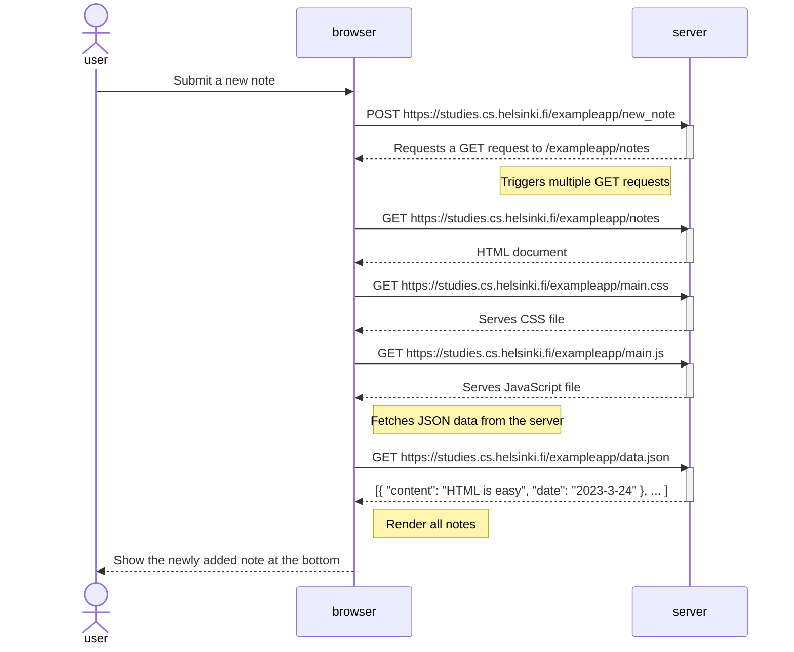

```mermaid
sequenceDiagram
    actor user
    participant browser
    participant server
    
    user->>browser: Submit a new note
    
    browser->>server: POST https://studies.cs.helsinki.fi/exampleapp/new_note
    activate server
    server-->>browser: Requests a GET request to /exampleapp/notes
    deactivate server
    
    Note left of server: Triggers multiple GET requests
    
    browser->>server: GET https://studies.cs.helsinki.fi/exampleapp/notes
    activate server
    server-->>browser: HTML document
    deactivate server

    browser->>server: GET https://studies.cs.helsinki.fi/exampleapp/main.css
    activate server
    server-->>browser: Serves CSS file
    deactivate server

    browser->>server: GET https://studies.cs.helsinki.fi/exampleapp/main.js
    activate server
    server-->>browser: Serves JavaScript file
    deactivate server

    Note right of browser: Fetches JSON data from the server

    browser->>server: GET https://studies.cs.helsinki.fi/exampleapp/data.json
    activate server
    server-->>browser: [{ "content": "HTML is easy", "date": "2023-3-24" }, ... ]
    deactivate server

    Note right of browser: Render all notes
    
    browser-->>user: Show the newly added note at the bottom
    
```
