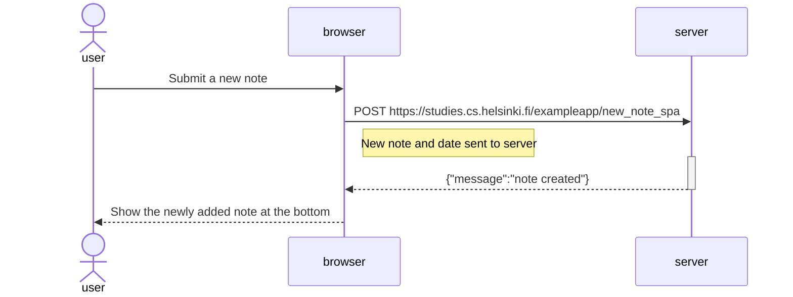

```mermaid
sequenceDiagram
    actor user
    participant browser
    participant server
    
    user->>browser: Submit a new note
   
    browser->>server: POST https://studies.cs.helsinki.fi/exampleapp/new_note_spa
    Note right of browser: New note and date sent to server
    
    activate server
    server-->>browser: {"message":"note created"}
    deactivate server
    
    browser-->>user: Show the newly added note at the bottom   
```
